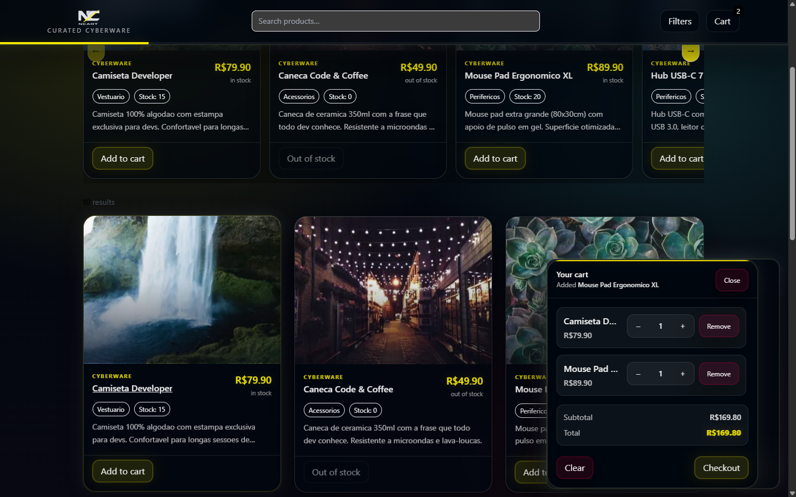
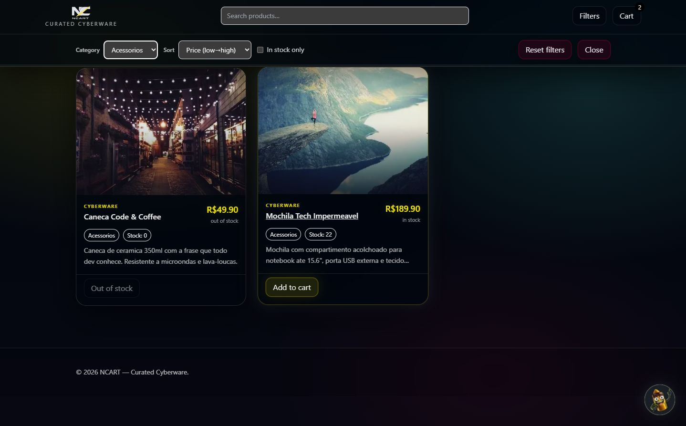
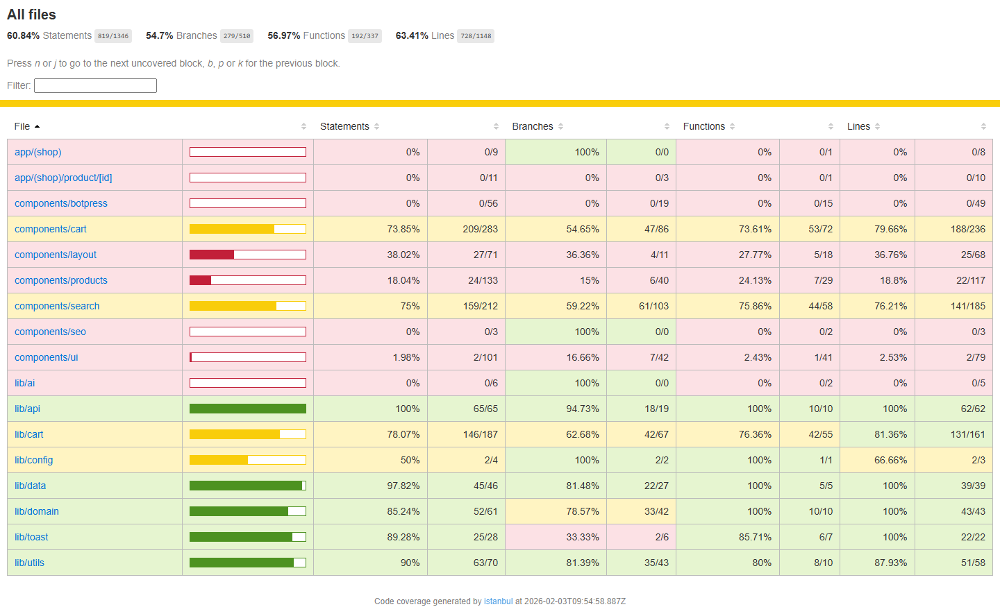
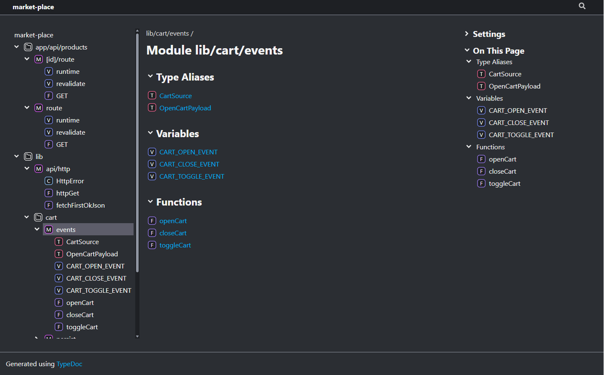
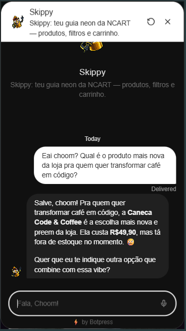
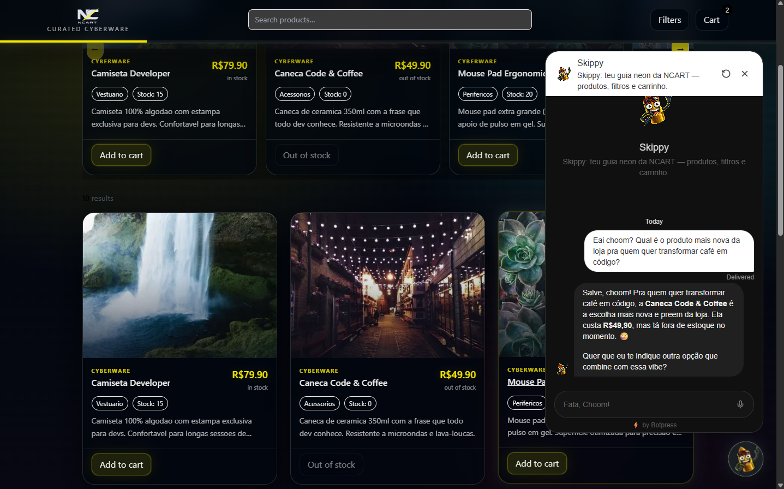

# NCART — Curated Cyberware 🛒⚡

Mini e-commerce funcional construído para o desafio de Frontend Junior da Uncode (ecossistema Nuvemshop / VNDA), com foco pesado em **DX**, **organização**, **UX “SPA premium”**, **testes** e **documentação TypeDoc**.

- **Repo:** https://github.com/IvanFerroli/Market-Place
- **Deploy (Vercel):** https://ncart.vercel.app/

## **Transparência:** 
usei IA como apoio em partes do desenvolvimento (ideação, debug e documentação), com validação manual e cobertura via testes (unit/e2e) para garantir consistência.

## ✨ O que tem aqui (highlights)

- **UI completa do e-commerce**
  - Home com grid/listagem e vitrine (carousel SSR)
  - Página de produto (`/product/[id]`)
  - Header com logo + badge de quantidade no carrinho
  - Footer simples

- **Carrinho “mini” com experiência SPA premium**
  - Abre pelo ícone do carrinho no header
  - Lista itens, remove, altera quantidade (+/–), total em tempo real
  - Implementado como **overlay/toast** (com infra própria) mantendo a equivalência funcional do drawer/sidebar

<!-- IMAGE: Mini cart aberto como sidebar (ancorado à direita) -->



- **Busca + filtros + ordenação (UI)**
  - Componentes dedicados com comportamento consistente e foco em UX

<!-- IMAGE: Filters UI (category, sort, in-stock, reset) -->



- **DX de projeto “de time”**
  - Script **one-command bootstrap** (`dx`) para rodar/validar rápido (inclui cuidados para Windows/WSL)

- **Qualidade**
  - **Unit tests** (Jest) cobrindo regras do carrinho, componentes e helpers
  - **E2E** (Playwright) com fluxo crítico do carrinho

- **Documentação**
  - **TypeDoc gerado** em `docs/typedoc/` (pronto para abrir localmente ou publicar em Pages)

- **Extras (diferenciais do desafio)**
  - Integração opcional de chatbot via Botpress (Skippy)
  - SEO básico (metatags + JSON-LD + sitemap)

---

## 🧱 Stack

- Next.js (App Router) + TypeScript
- TailwindCSS
- Jest (unit) + Playwright (E2E)
- TypeDoc (docs)
- Deploy em Vercel

---

## 🚀 Quickstart

### Requisitos

- **Node 20+** recomendado
- **pnpm** (via corepack) recomendado

### Rodar com o “one command” (DX)

Esse projeto tem um bootstrap focado em reduzir atrito de avaliação/onboarding:

```bash
corepack enable
pnpm dx

```

**O que o `dx` faz (visão geral):**

- valida ambiente (Node)
- instala deps de forma idempotente
- prepara `.env.local` (incluindo variável do Botpress, se você usar)
- sobe o dev server
- abre UI/docs (configurável)
- pode rodar testes e E2E por toggle

### Rodar “manual” (clássico)

```bash
corepack enable
pnpm install
pnpm dev
```

Acesse: `http://localhost:3000`

---

## 🔌 API (contrato do desafio)

O desafio pede uma API lendo `products.json` e expondo **no mínimo**:

- `GET /products` → lista todos os produtos
- `GET /products/:id` → detalhe do produto por ID

### Implementação no projeto

A leitura dos dados parte de:

- `public/data/products.json`

A implementação base (Next Route Handlers) vive em:

- `app/api/products/route.ts`
- `app/api/products/[id]/route.ts`

### Endpoints suportados (compatibilidade)

Este projeto foi feito para **respeitar o contrato do desafio** (`/products`) sem perder o padrão do Next (`/api/...`).
Na prática, você pode usar:

- `GET /products` **(contrato do desafio)**
- `GET /products/:id` **(contrato do desafio)**
- `GET /api/products` **(compat / Next)**
- `GET /api/products/:id` **(compat / Next)**

> Internamente, o client/infra pode tentar mais de uma URL (ex.: `/products` e fallback em `/api/products`) para facilitar execução em diferentes ambientes.

---

## 🧠 Decisões técnicas que carregam o projeto

> Versão longa e “defensável em entrevista” está em `DECISIONS.md`.

### 1) Domínio como truth-source (menos bug, mais teste)

Camada `lib/domain/` centraliza invariantes:

- `Money` em **centavos** (evita bugs clássicos de float)
- `Product` tipado com guards
- `Cart` com helpers de subtotal/quantidade

### 2) Carrinho com store + persistência isolada de UI

Em `lib/cart/`:

- actions mínimas (`add/remove/setQty`)
- selectors e regras (`totals`) fora do componente
- persistência separada (sem “vazar UI para o core”)

Isso permitiu evoluir o carrinho de drawer clássico para overlay/toast sem quebrar a lógica.

### 3) Infra de overlays/eventos (cart + quick view)

Em vez de “um modal solto”, existe uma infra consistente:

- provider de overlay
- eventos open/close
- exclusividade (não competir Quick View x Cart)
- feedback de UX coeso

### 4) DX de verdade (especialmente pra Windows/WSL)

`scripts/dx.mjs` resolve “dor real”:

- previsibilidade de primeiro run
- abertura de UI/docs de forma mais confiável no WSL
- toggles pra não virar “script mágico”

---

## ✅ Checklist do desafio (mapeamento)

### Obrigatórios

- [x] Framework (Next.js)
- [x] API lendo `products.json` e endpoints mínimos
- [x] Home com listagem (imagem, nome, preço)
- [x] Página de produto com “Adicionar ao carrinho”
- [x] Header com ícone do carrinho e quantidade
- [x] Footer simples
- [x] Mini cart com lista, qty (+/–), remover, total em tempo real
- [x] Responsividade (mobile-first; 375px e 1440px)
- [x] Deploy público (link acima)
- [x] Documentação (README + `DECISIONS.md`)

### Diferenciais

- [x] TypeScript
- [x] Testes unitários
- [x] E2E com Playwright
- [x] Busca/filtros/ordenação
- [x] A11y (aria labels, comportamento de overlay, foco/UX)
- [x] SEO básico (Meta + JSON-LD + sitemap)
- [x] Integração com IA (chatbot opcional)

---

## 🧪 Testes

### Unit (Jest)

```bash
pnpm test
```

### Coverage

```bash
pnpm test --coverage
```

<!-- IMAGE: Coverage report -->



### E2E (Playwright)

```bash
pnpm e2e
```

Depois, abra o relatório gerado:

- `playwright-report/index.html`

---

## 📚 Documentação (TypeDoc)

Geração:

```bash
pnpm docs
```

Saída:

- `docs/typedoc/index.html`

<!-- IMAGE: TypeDoc index -->



---

## 🤖 IA / Chatbot (opcional)

O projeto suporta um widget de chat (Skippy) via Botpress.

<!-- IMAGE: Skippy chatbot (mobile) -->



Configure no `.env.local`:

```bash
NEXT_PUBLIC_BOTPRESS_CONFIG_SCRIPT_URL="COLE_AQUI_O_SCRIPT_DO_BOTPRESS"
```

<!-- IMAGE: Chat bubble -->



---

## 🗂️ Estrutura de pastas (visão rápida)

> A ideia aqui é deixar **avaliador bater o olho** e entender onde vive cada responsabilidade.

```txt
app/
  (shop)/
    page.tsx
    product/[id]/page.tsx
  api/
    products/route.ts
    products/[id]/route.ts

components/
  cart/        # badge, botão, qty stepper, summary, provider do mini cart
  products/    # card, carousel, quick view
  search/      # search bar, filter bar, sort select, hide-when*
  seo/         # JsonLd + MetaTags
  layout/      # header/footer/container
  botpress/    # SkippyWebchat

lib/
  domain/      # Money, Product, Cart (truth-source)
  data/        # leitura/serviço de produtos
  cart/        # store, rules, selectors, persist, events
  api/         # http helpers + client
  ai/          # prompts/recommend/search
  config/      # env + constants
```

---

## 🧾 Notas importantes (pra avaliação)

- **Drawer/sidebar vs overlay/toast:** o minicarrinho abre pelo ícone do header e aparece como **painel lateral (ancorado à direita)** com backdrop — mantendo o requisito de “drawer/sidebar” do desafio. A infra de overlay/toast foi escolhida para consistência de UX com o Quick View (não foi atalho; foi upgrade), preservando lista/qty/remove/total em tempo real.
- **Dica pro avaliador:** confira o print/gif do carrinho aberto em `docs/images/` (mostra claramente o comportamento de sidebar).

- **Rota de produto:** `/product/[id]` ...
  é canônica no projeto por clareza; se você quiser blindar 100% com o enunciado (`/p/[id]`), dá pra adicionar alias/redirect sem mudar o resto.

---

## 📎 Links

- Deploy: [https://ncart.vercel.app/](https://ncart.vercel.app/)
- Repositório: [https://github.com/IvanFerroli/Market-Place](https://github.com/IvanFerroli/Market-Place)

---

## 🏷️ Licença

Uso livre para fins de avaliação/portfólio. (Se você quiser formalizar: adicione um `LICENSE` com MIT.)

---
